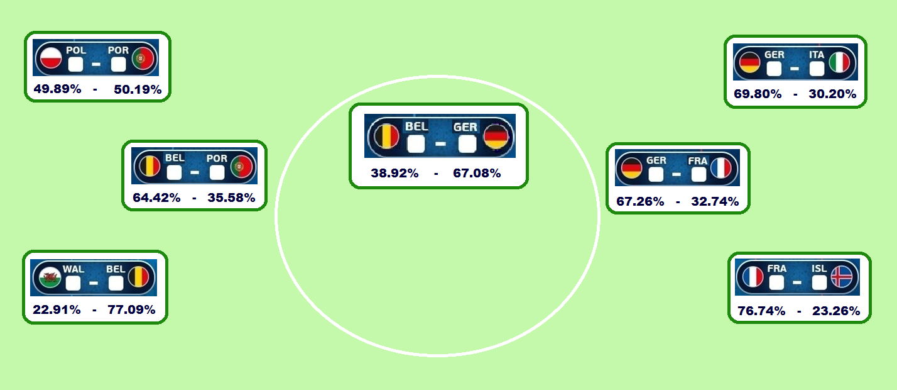

```{r setup, include=FALSE}
knitr::opts_chunk$set(echo = TRUE, comment = "")
```



# Welcome

This GitHub page describes predicting the 2016 european soccer championships matches using ordinal regression. The GitHub repository related to this page is [here](https://github.com/TuomoNieminen/EURO2016).

Articles (in finnish) describing the analysis and the predictions for the EURO 2016 finals are available in tyyppiarvo.com:

- [Group stage prediction article](http://tyyppiarvo.com/2016/06/jalkapallossa-kannattaa-laukoa-ennustimme-em-turnauksen-alkuvaiheen-ottelut-ja-jatkoonmenijat/)
- [Round of sixteen prediction article](http://tyyppiarvo.com/2016/06/tyyppiarvo-tutki-32768-mahdollista-skenaariota-belgia-saksa-todennakoisin-em-finaali/)
- [Quarterfinal prediction article](http://tyyppiarvo.com/2016/06/paivitetty-em-futisennuste-islanti-kuusinkertaisti-mahdollisuutensa-euroopan-mestariksi/)

Note that all articles are in Finnish.

# Qualifier data

I used statistics from the EURO championship qualifiers of 2008 and 2012 and studied how these could be used to predict match outcomes in the final tournament.

## Features


```{r}

emq <- get(load("data/EUROq.Rda"))
emq <- emq[complete.cases(emq),]
names(emq)

```

## Feature engineering

Since only the relative strength of two teams can be though to predict the outcome, I studied the ratios and differences of the qualifier statistics as predictors for the final tournament match goal differences and outcomes.

## Correlations of qualifier stats versus final tournament goal difference

I studied the connections of hometeam versus awayteam qualifier statistic ratios and differences against the final tournament match goal differences, using correlations. I did this to choose which statistics and which version (ratio or difference) I should use as predictors.

```{r}

# ratios and differences of team stats
homevars <- substr(names(emq),1,5)=="homeq"
awayvars <- substr(names(emq),1,5)=="awayq"
#fifa

homevars[7] <- T
awayvars[8] <- T
ratios <- emq[,homevars] / emq[,awayvars]
diffs <- emq[,homevars] - emq[,awayvars]

#correlations
corrs <- rbind(cor_ratios=apply(ratios, 2, cor, emq$goal_diff),
               cor_diffs=apply(diffs, 2, cor, emq$goal_diff))

t(corrs)
```


*Correlations of home vs awayteam qualifier statistic ratios and differences versus final tournament match goal difference. The strongest linear connections are given by the ratios, except with corners were the difference in qualifier corner kicks has the strongest connection to final tournament match goal difference.*

<br>

# Feature selection with regularized regression 

I fit an ordinal regression model with final tournament match outcome as the target variable and a selection of features correlating with the match goal difference as the explanatory variables. I used lasso regularisation to study which qualifier features best explain the final tournament match outcome.

```{r, message = FALSE}

features <- cbind(ratios[,1:4], diffs[,8])
colnames(features) <- c("fifa_r","on_r","off_r", "shot_r","corners_d")
outcome <- emq$outcome
library(glmnetcr)
netfit <- glmnet.cr(features, outcome, maxit=500)
```

## Bayesian information criteria and coefficient path (1)

```{r, fig.cap = "Bayesian information criteria (BIC) and the value of coefficients by the amount of regularization used in ordinal regression, where final tournament match outcomes are predicted by ratios or differences in qualifier match statistics. The best solution is the one where BIC is lowest. Only the offtarget shot ratio deviates from zero at this point."}

par(mfrow = c(2,1), mar=c(3,2,2,10), cex.axis=0.7)
plot(netfit, xvar="step", type="aic")
plot(netfit, xvar = "step", type = "coefficients")

```

<br>

I decided it didn't make sense that somewhow offtarget shots were a better predictor than ontarget shots and total shots. So I excluded the off and ontarget shots and used only the ratio of the total shots. 

```{r, message = FALSE}

features2 <- cbind(ratios[,c(1,4)], diffs[,8])
colnames(features2) <- c("fifa_r","shot_r","corners_d")
netfit2 <- glmnet.cr(features2, outcome, maxit=500)
```

## Bayesian information criteria and coefficient path (2)

```{r, fig.cap = "Bayesian information criteria (BIC) and the value of coefficients by the amount of regularization used in ordinal regression, where final tournament match outcomes are predicted by ratios or differences in qualifier match statistics. The best solution is the one where BIC is lowest. Only the shot ratio deviates from zero at this point."}

par(mfrow = c(2,1), mar=c(3,2,2,10), cex.axis=0.7)
plot(netfit2, xvar="step", type="aic")
plot(netfit2, xvar = "step", type = "coefficients")

```

<br>

## A scatter plot of shot ratio versus goal difference

```{r}

# a scatter plot of shots ratio and goal difference
shot_ratio <- ratios[,4]
goal_diff <- emq$goal_diff
plot(shot_ratio, goal_diff,
     xlab="SR", 
     ylab="match goal difference",
     main="Qualifier shot ratio (SR) 
     versus tournament match goal difference 
     EM 2008 & 2012",
     col="green4", pch=20)
abline(lm(goal_diff~shot_ratio), col="darksalmon")
legend("bottomright",
       legend=paste("correlation:",round(cor(shot_ratio, goal_diff),2)),
       bty="n")

```

<br>

## Ordinal regression with shot ratio

I fit the first of two ordinal regression models using only the qualifiers shot ratio as the explanatory variable.

```{r}
library(MASS)
fit1 <- polr(outcome ~ shot_ratio, Hess=T)
cbind.data.frame(outcome = outcome, 
                 prediction = predict(fit1, type="probs"))
```


# Uefa ratings

I also studied the pre-tournament uefa rating as a predictor to the matches. The definition of the uefa rating changed after 2008 so only the data from 2012 could be used in the analysis.

## Correlation of pre-tournament uefa ratio and tournament match goal difference

```{r}

emu <- read.csv2("data/em2012_uefa.csv", stringsAsFactors = F)
emu$uefa_ratio <- emu$uefa_koti / emu$uefa_vieras
emu$goal_diff <- emu$maalit_koti - emu$maalit_vieras

uefa_ratio <- emu$uefa_ratio
goal_diff2 <- emu$goal_diff

cor.test(uefa_ratio, goal_diff2)
```

<br>

## Scatter plot of uefa ratio versus match goals

```{r}

plot(uefa_ratio,goal_diff2,
     xlab="UCR", 
     ylab="match goal difference",
     main="Uefa coefficient ratio (UCR) 
     versus tournament match goal difference \n  EM 2012.",
     col="green4", pch=20)
abline(lm(goal_diff2~uefa_ratio), col="darksalmon")
legend("bottomright",
       legend=paste("correlation:",round(cor(uefa_ratio, goal_diff2),2)),
       bty="n")

```

<br>

## Ordinal regression with uefa ratio

Pre-tournament uefa ratio correlated reasonably with the final tournament match goals so I fit a second ordinal regression model using the uefa ratio as a predictor.

```{r}
# model based on 2012 uefa ratings
# define the outcome
emu$outcome <- 1
emu$outcome[emu$goal_diff > 0] <- 3
emu$outcome[emu$goal_diff < 0 ] <- 0
emu$outcome <- factor(emu$outcome,ordered = T, levels=c(0,1,3),labels=c("loss","draw","win"))

fit2 <- polr(outcome ~ uefa_ratio, Hess=T, data=emu)

cbind.data.frame(outcome = emu$outcome, 
                 prediction = predict(fit2, type="probs"))

```

<br>

# The 2016 matches and predictions

I averaged the predictions given by the two ordinal regression models to predict the matches of the 2016 tournament, using the ratio of qualifier shots and uefa ratings as the predicting features.

```{r}

# load 2016 matches
matches2016 <- get(load("data/matches2016.Rda"))

# use mass library to fit ordinal regression models
library(MASS)

# use the models to predict match outcome probabilities for 2016
probs1 <- predict(fit1, newdata=matches2016, type="probs")
probs2 <- predict(fit2, newdata=matches2016, type="probs")

# combine the predictions with the match data

predictions2016 <- 0.5*(probs1+probs2)[,3:1]
alkulohko <- cbind(matches2016, predictions2016)

# exclude the explanatory variables 
alkulohko2016 <- alkulohko[,c("date","group","hometeam","awayteam","win","draw","loss", "homeuefa", "awayuefa", "uefa_ratio", "homeavrg_shots", "awayavrg_shots", "shot_ratio")]
alkulohko2016
```

<br>

## Expected points per match

```{r}

# calculate expected points per match
getEV <- function(p) {sum(c(3,1,0)*p)}
homePoints <- apply(predictions2016, 1, getEV)
awayPoints <- apply(predictions2016[,3:1], 1, getEV)
alkulohko2016 <- cbind(alkulohko2016[, 1:7], homePoints, awayPoints)
# rounding
alkulohko2016[,5:9] <- round(alkulohko2016[,5:9], 2)

alkulohko2016
```

<br>

## Expected points by group

```{r}

# calculate expected points by group

#  function
get_total_points <- function(data, team) {
  homedata <- data[data$hometeam==team,]
  awaydata <- data[data$awayteam==team,]
  homeEV <- sum(homedata$homePoints)
  awayEV <- sum(awaydata$awayPoints)
  return(homeEV+awayEV)
}

group <- alkulohko2016$group

#  group predictions
by(alkulohko2016,group,FUN=function(d) {
  teams <- unique(c(d$hometeam,d$awayteam))
  points <- t(sort(sapply(teams,get_total_points,data=d),decreasing = T))
  rownames(points) <- "points"
  points
})

```

<br>

<hr>

Tuomo Nieminen 2017

<br>